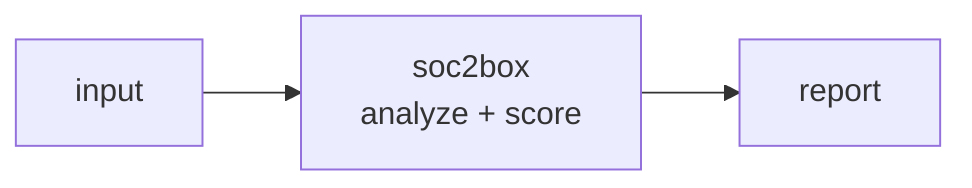

<a name="top"></a>
<div align="center">


# SOC2BOX

### SOC 2 evidence collector and control tracker, self-hosted


[](https://pypi.org/project/cognis-soc2box/) [](https://github.com/cognis-digital/soc2box/actions) [](LICENSE) [](https://github.com/cognis-digital)

*Compliance & GRC — get audit-ready and stay there, self-hosted.*

</div>

```bash
pip install cognis-soc2box
soc2box scan .            # → prioritized findings in seconds
```

## Usage — step by step

1. **Install** the CLI (console script `soc2box`):
   ```bash
   pip install cognis-soc2box
   ```
2. **Initialize a program** — `init` seeds a program file (default `soc2_program.json`) with the default TSC controls:
   ```bash
   soc2box init --company "Acme Inc" --framework "SOC 2 Type II"
   ```
3. **Attach evidence to a control** — `add` records a dated artifact against a control id:
   ```bash
   soc2box add CC6.1 https://drive/screenshot.png --by jdoe --note "Q2 access review"
   ```
4. **Read status / readiness** — `status` shows per-control freshness, `report` gives the overall readiness %, and `gaps` lists what is missing/stale (exit `2` when gaps remain):
   ```bash
   soc2box report
   soc2box status --format json | jq '.[] | select(.status!="satisfied")'
   ```
5. **Automate as an audit gate** — `gaps` returns nonzero while controls still need attention:
   ```yaml
   - run: pip install cognis-soc2box
   - run: soc2box gaps  # nonzero exit until the control set is satisfied
   ```

## Contents

- [Why soc2box?](#why) · [Features](#features) · [Quick start](#quick-start) · [Example](#example) · [Architecture](#architecture) · [AI stack](#ai-stack) · [How it compares](#how-it-compares) · [Integrations](#integrations) · [Install anywhere](#install-anywhere) · [Related](#related) · [Contributing](#contributing)

<a name="why"></a>
## Why soc2box?

hottest GRC niche, self-host

`soc2box` is single-purpose, scriptable, and self-hostable: point it at a target, get prioritized results in the format your workflow already speaks (table · JSON · SARIF), gate CI on it, and let agents drive it over MCP.

<div align="right"><a href="#top">↑ back to top</a></div>

<a name="features"></a>
## Features

- ✅ New Program
- ✅ Program To Dict
- ✅ Program From Dict
- ✅ Load Program
- ✅ Save Program
- ✅ Add Evidence
- ✅ Control Status
- ✅ Program Readiness
- ✅ Runs on Linux/macOS/Windows · Docker · devcontainer
- ✅ Ports in Python, JavaScript, Go, and Rust (`ports/`)

<div align="right"><a href="#top">↑ back to top</a></div>

<a name="quick-start"></a>
## Quick start

```bash
pip install cognis-soc2box
soc2box --version
soc2box scan .                       # scan current project
soc2box scan . --format json         # machine-readable
soc2box scan . --fail-on high        # CI gate (non-zero exit)
```

<div align="right"><a href="#top">↑ back to top</a></div>

<a name="example"></a>
## Example

```text
$ soc2box scan .
  [HIGH    ] SOC-001  example finding             (./src/app.py)
  [MEDIUM  ] SOC-002  another signal              (./config.yaml)

  2 findings · risk score 5 · 38ms
```

<div align="right"><a href="#top">↑ back to top</a></div>

<a name="architecture"></a>
## Architecture



<div align="right"><a href="#top">↑ back to top</a></div>

<a name="ai-stack"></a>
## Use it from any AI stack

`soc2box` is interoperable with every popular way of using AI:

- **MCP server** — `soc2box mcp` (Claude Desktop, Cursor, Cognis.Studio, [uncensored-fleet](https://github.com/cognis-digital/uncensored-fleet))
- **OpenAI-compatible / JSON** — pipe `soc2box scan . --format json` into any agent or LLM
- **LangChain · CrewAI · AutoGen · LlamaIndex** — wrap the CLI/JSON as a tool in one line
- **CI / scripts** — exit codes + SARIF for non-AI pipelines

<div align="right"><a href="#top">↑ back to top</a></div>

<a name="how-it-compares"></a>
## How it compares

| | **Cognis soc2box** | Comp AI |
|---|:---:|:---:|
| Self-hostable, no account | ✅ | varies |
| Single command, zero config | ✅ | ⚠️ |
| JSON + SARIF for CI | ✅ | varies |
| MCP-native (AI agents) | ✅ | ❌ |
| Polyglot ports (JS/Go/Rust) | ✅ | ❌ |
| Open license | ✅ COCL | varies |

*Built in the spirit of **Comp AI / Probo**, re-framed the Cognis way. Missing a credit? Open a PR.*

<div align="right"><a href="#top">↑ back to top</a></div>

<a name="integrations"></a>
## Integrations

Pipes into your stack: **SARIF** for code-scanning, **JSON** for anything, an **MCP server** (`soc2box mcp`) for AI agents, and a webhook forwarder for SIEM/Slack/Jira. See [`docs/INTEGRATIONS.md`](docs/INTEGRATIONS.md).

<div align="right"><a href="#top">↑ back to top</a></div>

<a name="install-anywhere"></a>
## Install — every way, every platform

```bash
pip install "git+https://github.com/cognis-digital/soc2box.git"    # pip (works today)
pipx install "git+https://github.com/cognis-digital/soc2box.git"   # isolated CLI
uv tool install "git+https://github.com/cognis-digital/soc2box.git" # uv
pip install cognis-soc2box                                          # PyPI (when published)
docker run --rm ghcr.io/cognis-digital/soc2box:latest --help        # Docker
brew install cognis-digital/tap/soc2box                             # Homebrew tap
curl -fsSL https://raw.githubusercontent.com/cognis-digital/soc2box/main/install.sh | sh
```

| Linux | macOS | Windows | Docker | Cloud |
|---|---|---|---|---|
| `scripts/setup-linux.sh` | `scripts/setup-macos.sh` | `scripts/setup-windows.ps1` | `docker run ghcr.io/cognis-digital/soc2box` | [DEPLOY.md](docs/DEPLOY.md) (AWS/Azure/GCP/k8s) |

<div align="right"><a href="#top">↑ back to top</a></div>

<a name="related"></a>
## Related Cognis tools

- [`gdprkit`](https://github.com/cognis-digital/gdprkit) — GDPR/CCPA DSAR, RoPA, and cookie-consent toolkit
- [`policyforge`](https://github.com/cognis-digital/policyforge) — Auto-generate security policies from a short questionnaire
- [`vendorvet`](https://github.com/cognis-digital/vendorvet) — Third-party / vendor risk questionnaires with SBOM cross-ref
- [`auditrail`](https://github.com/cognis-digital/auditrail) — Tamper-evident audit-log aggregator with hash-chained attestation
- [`frameworkmap`](https://github.com/cognis-digital/frameworkmap) — Crosswalk controls across NIST, ISO 27001, SOC 2, CMMC, PCI
- [`dpiaforge`](https://github.com/cognis-digital/dpiaforge) — DPIA and EU AI Act impact-assessment generator

**Explore the suite →** [🗂️ all 170+ tools](https://github.com/cognis-digital/cognis-neural-suite) · [⭐ awesome-cognis](https://github.com/cognis-digital/awesome-cognis) · [🔗 cognis-sources](https://github.com/cognis-digital/cognis-sources) · [🤖 uncensored-fleet](https://github.com/cognis-digital/uncensored-fleet) · [🧠 engram](https://github.com/cognis-digital/engram)

<div align="right"><a href="#top">↑ back to top</a></div>

<a name="contributing"></a>
## Contributing

PRs, new rules, and demo scenarios are welcome under the collaboration-pull model — see [CONTRIBUTING.md](CONTRIBUTING.md) and [SECURITY.md](SECURITY.md).

> ### ⭐ If `soc2box` saved you time, **star it** — it genuinely helps others find it.

## Interoperability

`{}` composes with the 300+ tool Cognis suite — JSON in/out and a shared
OpenAI-compatible `/v1` backbone. See **[INTEROP.md](INTEROP.md)** for the
suite map, composition patterns, and reference stacks.

## License

Source-available under the **Cognis Open Collaboration License (COCL) v1.0** — free for personal, internal-evaluation, research, and educational use; **commercial / production use requires a license** (licensing@cognis.digital). See [LICENSE](LICENSE).

---

<div align="center"><sub><b><a href="https://cognis.digital">Cognis Digital</a></b> · one of 170+ tools in the <a href="https://github.com/cognis-digital/cognis-neural-suite">Cognis Neural Suite</a> · <i>Making Tomorrow Better Today</i></sub></div>
